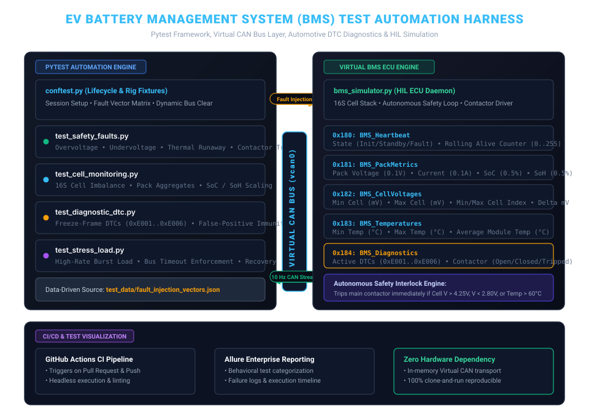

# `pytest-bms-diagnostic-framework`

[](https://python.org)
[](https://pytest.org)
[](https://iso.org)
[](https://allurereport.org)
[](.github/workflows/run_tests.yml)
[](LICENSE)

An enterprise-grade **Automated Hardware-in-the-Loop (HIL) Test Framework** for Electric Vehicle (EV) Battery Management Systems (BMS). Built with **Pytest**, the framework validates high-voltage battery safety interlocks, contactor opening latency, and Diagnostic Trouble Codes (DTCs) across simulated 16S battery packs over a deterministic virtual CAN bus layer.

---

## 1. System Architecture & Test Harness Data Flow

The harness models a complete closed-loop automotive HIL environment without requiring physical high-voltage batteries or expensive CAN hardware:



### Key Architectural Layers:
1. **Pytest Test Automation Layer (`tests/`):** Manages test lifecycle, data-driven injection matrices, assertions, and Allure report telemetry.
2. **Global Fixture Harness (`conftest.py`):** Provides session/module-scoped simulator daemons and function-scoped bus flushing for 100% test isolation.
3. **Virtual CAN Transport (`core/transport_can.py`):** Thread-safe in-memory message queue (`vcan0`) mimicking real automotive CAN controllers with timeout and filtering.
4. **BMS ECU HIL Simulator (`core/bms_simulator.py`):** Background thread simulating a 16S battery pack running a 10 Hz periodic CAN broadcast engine with autonomous safety interlocks.

---

## 2. CAN Frame Protocol Specification

The framework exercises a standard automotive 5-frame periodic CAN matrix:

| CAN ID | Frame Name | Periodicity | Key Telemetry / Bitfields |
| :---: | :--- | :---: | :--- |
| **`0x180`** | `BMS_Heartbeat` | 100 ms (10 Hz) | Operating State (`INIT`, `STANDBY`, `CHARGING`, `FAULT`), 8-bit Rolling Alive Counter |
| **`0x181`** | `BMS_PackMetrics` | 100 ms (10 Hz) | Pack Voltage ($0.1\,\text{V}$), Pack Current ($0.1\,\text{A}$), State of Charge (SoC $0.5\%$), State of Health (SoH $0.5\%$) |
| **`0x182`** | `BMS_CellVoltages` | 100 ms (10 Hz) | Min/Max Cell Voltage ($\text{mV}$), Min/Max Cell Index, Pack Imbalance Delta ($\text{mV}$) |
| **`0x183`** | `BMS_Temperatures` | 100 ms (10 Hz) | Min, Max, and Average Module Temperatures ($-40^\circ\text{C} \dots +125^\circ\text{C}$) |
| **`0x184`** | `BMS_Diagnostics` | 100 ms (10 Hz) | Active Diagnostic Trouble Codes (DTCs), Contactor State (`OPEN`, `CLOSED`, `FAULT_TRIPPED`), Fault Counter |

---

## 3. Test Coverage Matrix

The suite includes **13 automated test cases** categorized into dedicated operational domains:

```
tests/
├── test_bms_handshake.py     # Smoke & Protocol Connectivity
│   ├── test_bms_heartbeat_broadcast          -> Verifies 10 Hz broadcast and valid state
│   ├── test_all_mandatory_can_ids_present    -> Asserts presence of 0x180..0x184 frames
│   └── test_alive_counter_increments         -> Validates rolling alive counter continuity
├── test_cell_monitoring.py   # Cell Telemetry & Aggregation
│   ├── test_pack_voltage_aggregate_accuracy  -> Compares sum of 16 cells with reported pack voltage
│   ├── test_cell_extremes_identification     -> Verifies min/max cell voltage and index tracking
│   ├── test_temperature_sensor_averaging    -> Asserts thermal sensor mean and peak calculation
│   └── test_soc_soh_bounds_and_scaling       -> Validates 0-100% percentage boundary compliance
├── test_safety_faults.py     # ISO 26262 Safety & Contactor Shutdown
│   ├── test_data_driven_fault_injection      -> Data-driven matrix (Overvoltage, Undervoltage, Overtemp, Overcurrent)
│   └── test_fault_clearing_and_system_recovery-> Tests post-fault recovery and contactor re-closure
├── test_diagnostic_dtc.py    # Diagnostic Trouble Code Validation
│   ├── test_no_false_positive_dtcs_under_nominal -> Asserts zero DTCs in healthy steady-state
│   └── test_multiple_simultaneous_dtcs       -> Multi-fault arbitration and priority reporting
└── test_stress_load.py       # Stress & Asynchronous Bus Robustness
    ├── test_bus_burst_load_stability         -> 100-frame burst transmission without frame drop
    └── test_missing_frame_detection_timeout   -> Strict timeout enforcement on unassigned CAN IDs
```

---

## 4. Quickstart & Execution Guide

### Prerequisites
* Python 3.10 or newer

### Setup Virtual Environment
```bash
# Clone the repository
git clone https://github.com/your-username/pytest-bms-diagnostic-framework.git
cd pytest-bms-diagnostic-framework

# Create and activate virtual environment
python -m venv .venv
source .venv/bin/activate       # On Linux/macOS
.\.venv\Scripts\activate        # On Windows

# Install dependencies
pip install -r requirements.txt
```

### Run Tests
```bash
# Run the complete test suite with verbose output
pytest -v

# Run only safety-critical tests
pytest -m safety -v

# Run smoke tests
pytest -m smoke -v

# Generate Allure reporting telemetry
pytest -v --alluredir=allure-results
```

---

## 5. Verified Test Execution Log

Captured on Python 3.12 with all 13 test cases passing in under 4 seconds:

```text
============================= test session starts =============================
platform win32 -- Python 3.12.10, pytest-9.1.1, pluggy-1.6.0
rootdir: E:/.../pytest-bms-diagnostic-framework
configfile: pytest.ini
testpaths: tests
plugins: allure-pytest-2.16.2
collected 13 items

tests/test_bms_handshake.py::test_bms_heartbeat_broadcast PASSED         [  7%]
tests/test_bms_handshake.py::test_all_mandatory_can_ids_present PASSED   [ 15%]
tests/test_bms_handshake.py::test_alive_counter_increments PASSED        [ 23%]
tests/test_cell_monitoring.py::test_pack_voltage_aggregate_accuracy PASSED [ 30%]
tests/test_cell_monitoring.py::test_cell_extremes_identification PASSED  [ 38%]
tests/test_cell_monitoring.py::test_temperature_sensor_averaging PASSED  [ 46%]
tests/test_cell_monitoring.py::test_soc_soh_bounds_and_scaling PASSED    [ 53%]
tests/test_diagnostic_dtc.py::test_no_false_positive_dtcs_under_nominal PASSED [ 61%]
tests/test_diagnostic_dtc.py::test_multiple_simultaneous_dtcs PASSED     [ 69%]
tests/test_safety_faults.py::test_data_driven_fault_injection PASSED     [ 76%]
tests/test_safety_faults.py::test_fault_clearing_and_system_recovery PASSED [ 84%]
tests/test_stress_load.py::test_bus_burst_load_stability PASSED          [ 92%]
tests/test_stress_load.py::test_missing_frame_detection_timeout PASSED   [100%]

============================= 13 passed in 3.39s ==============================
```

---

## 6. Engineering Decisions & Architecture Rationale

### A. Zero Hardware Dependency via Virtual CAN Transport
Running automated tests on physical CAN hardware (Vector CANoe, PCAN, Kvaser) creates a bottleneck for CI/CD pipelines. This framework implements an in-memory `VirtualCANBus` queue transport with deterministic millisecond timeouts, allowing anyone to clone and run the entire suite in headless environments (e.g., GitHub Actions).

### B. Strict Fixture Isolation & State Teardown
Asynchronous embedded testing often suffers from state leakage (e.g., a DTC triggered in Test A persisting into Test B). In `conftest.py`, the `bms_session` fixture invokes `sim.clear_faults()` and `bus.clear()` before and after every individual test function, guaranteeing clean baseline conditions.

### C. Data-Driven JSON Test Matrices
Safety threshold validations are separated from test logic using `test_data/fault_injection_vectors.json`. Calibration engineers can update voltage and temperature limits without modifying Python source code.

---

## 7. License
This project is licensed under the **MIT License**.
